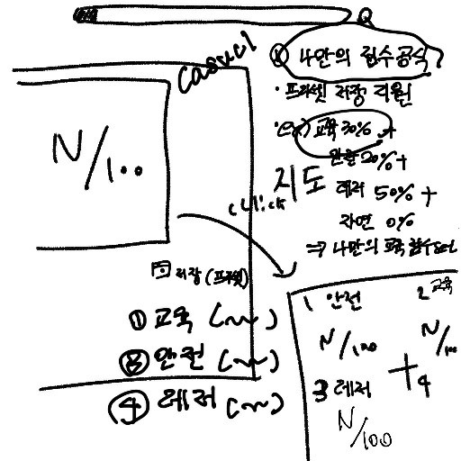
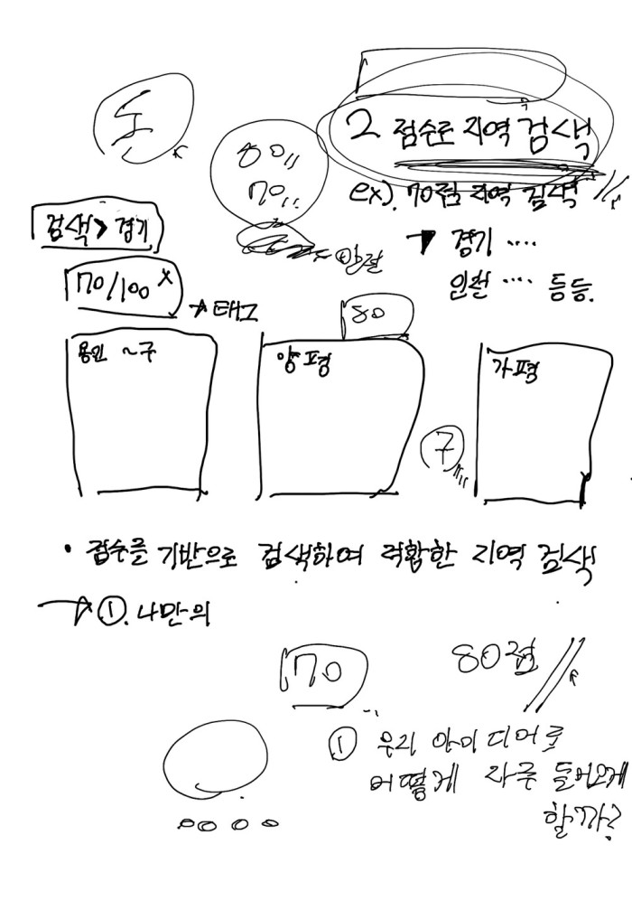
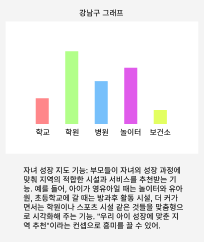
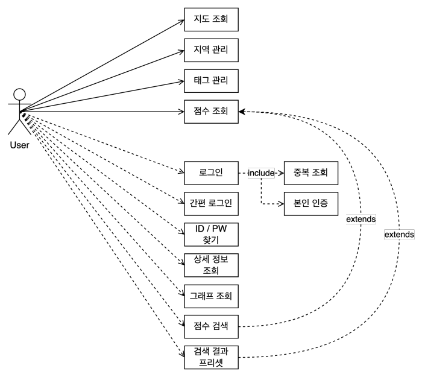

# 2024.10.04 회의

| **항목**    | **내용**        |
|-----------|---------------|
| **회의 목록** | 공모전          |
| **장소**  | 비트캠프          |
| **날짜**    | 2024년 10월 4일   |
| **시간**  | 15:30 ~ 17:00 |
| **작성자** | 황민지 |

**참석자**

| **이선아** | **장혜정** | **이가람** | **황민지** | **이태정** | **김주연** |
| --- | --- | --- | --- | --- | --- |
| 불참(개인 사정) | **O** | **O** | **O** | **O** | **O** |

 

### 🏷️ 회의 내용

---

1. 가람 : 점수 계산 공식화 (하단 추가 자료 제공)

2. 태정 : 그래프 기능 추가안 (하단 추가 자료 제공)

3. 주연 : 우선 순위 커스터마이징 기능 + 점수로 검색하는 방안 (ex. ~시에서 ~태그 80점 이상인 읍/면/동) (하단 추가 자료 제공)
-> 커스터 마이징관련으로 프리셋 이야기가 나와 추가된 논의안 :
이전 : 검색 결과를 이미지처럼 캡쳐해 마이페이지에서 확인 할 수 있게 하려고 했었음.
이후 : 이미지는 용량 및 저장방식이 까다로울 것 같아 검색 했던 세팅을 프리셋으로 만들어 마이페이지에 저장해주자.

4. 민지 : 카카오 맵과 맘편이 지도의 차이점
    - 카카오 맵의 사용자는 일반적인 사람들임.
    - 그래서 태그가 대부분 음식점, 카페, 버스 정류장, 지하철 등 일상 생활 속 태그들로 이루어짐
    - 아동 관련 시설을 알고 싶으면 하나하나 검색해야함 (ex. 소아과)
    - 근데 "소아과"를 검색 시 "서울시 전체" 검색 개수가 나옴 : 2730개
    - 더보기 클릭 전 해당 읍/면/동의 "대표" 소아과 5개가 먼저 노출됨, 더보기 클릭 후 나머지 검색 결과 노출됨
    - 5개의 히스토리 자동 기록됨 : 지역 명이 아닌 검색한 장소(건물명 or 업소명)이 히스토리에 기록됨
    - 비교 기능 미지원
    

### 🏷️ 다음 회의 주제 정하기
    
---

**(전가빈님과 멘토링 전까지 준비사항)**

1. Usecase - 작성완료 (수정이 필요한 부분 있나요?)

2. 기획서 10장 작성

3. 질문지 준비

- 기획서 추가할만한 내용 생각해오기

### 🏷️ 회의 결과

---

**usecase 작성 (하단 추가 이미지 제공)**

**[필수기능]**
- 지도 조회
- 지역 관리
- 태그 관리
-> 카카오 API를 대충 사용해보니 검색을 활용하게 되면 자유도가 너무 높아짐.
아예 아동 관련 태그를 제공해준 후 해당 태그 중 몇개를 사용자가 골라 검색 할 수 있도록 하는 것이 어떤가하는 의견 제시안 도출
- 점수 조회

**[확장 기능]**
- 로그인 -> 중복 체크 -> 본인 인증
- 간편 로그인
- ID / PW 찾기
- 검색 상세정보 (기관명, 번호 등..)
- 그래프 조회
- 점수 검색
- 검색 결과 프리셋? 검색 세팅 프리셋?

**[추가 자료]**
1. 가람 : <a href="https://board.worksmobile.com/main/article/4070000000149287725?t=15244&boardNo=4070000000148462678">점수 계산 게시글 링크</a>

2. 주연 : 우선순위 커스터마이징 및 점수검색 이미지
> 
> 

3. 태정 : 그래프 기능 추가안 이미지
> 
 
4. usecase 이미지 (파일 다운로드)
> 
